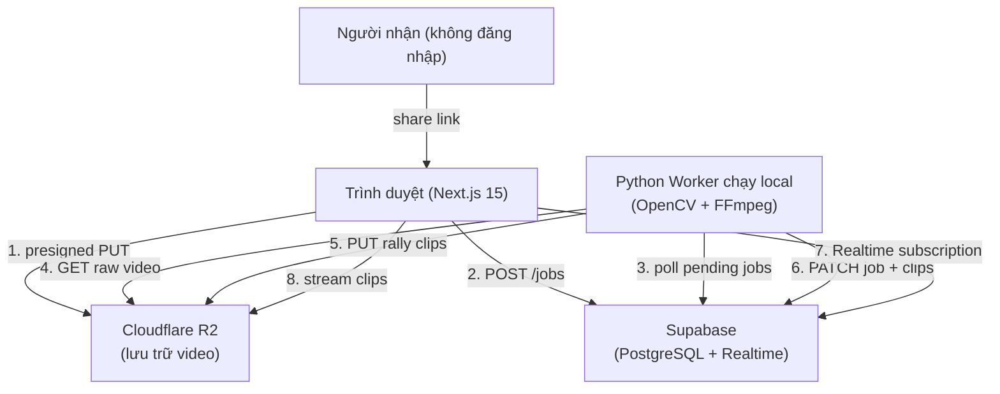

# Thiết kế hệ thống & Kiến trúc

## Tổng quan kiến trúc



**Quyết định kiến trúc chính:** Không có backend server luôn chạy. Frontend giao tiếp trực tiếp với Supabase và R2. Python worker chạy local poll Supabase để lấy job và xử lý trên máy của người dùng. Cách này loại bỏ hoàn toàn chi phí server trong MVP.

## Data Models

### Bảng `jobs` (Supabase)
```sql
id            uuid PRIMARY KEY DEFAULT gen_random_uuid()
created_at    timestamptz DEFAULT now()
status        text CHECK (status IN ('pending','processing','done','failed'))
raw_video_key text        -- R2 object key cho video đã upload
duration_sec  integer     -- thời lượng video tính bằng giây
clip_count    integer     -- điền sau khi xử lý xong
error_msg     text        -- nếu thất bại
metadata      jsonb       -- tên file, kích thước, thông tin codec
```

### Bảng `clips` (Supabase)
```sql
id              uuid PRIMARY KEY DEFAULT gen_random_uuid()
job_id          uuid REFERENCES jobs(id) ON DELETE CASCADE
clip_index      integer       -- thứ tự trong buổi tập/thi đấu
ai_start_sec    float         -- timecode bắt đầu do AI phát hiện (bất biến, để tham chiếu)
ai_end_sec      float         -- timecode kết thúc do AI phát hiện (bất biến, để tham chiếu)
start_sec       float         -- timecode bắt đầu hiệu lực (có thể thay đổi sau khi user chỉnh)
end_sec         float         -- timecode kết thúc hiệu lực (có thể thay đổi sau khi user chỉnh)
duration_sec    float         -- tính từ: end_sec - start_sec
clip_key        text          -- R2 object key cho file clip hiện tại
thumbnail_key   text          -- R2 object key cho ảnh thumbnail
share_token     text UNIQUE DEFAULT encode(gen_random_bytes(12), 'base64')
edit_status     text CHECK (edit_status IN ('original','pending_recut','recut')) DEFAULT 'original'
created_at      timestamptz DEFAULT now()
updated_at      timestamptz DEFAULT now()
```

**Lý do tách `ai_start_sec` / `ai_end_sec` khỏi `start_sec` / `end_sec`:**
Bounds do AI phát hiện được lưu bất biến làm tham chiếu để người dùng luôn biết bản cắt gốc. `start_sec`/`end_sec` chứa bounds hiệu lực (có thể đã được user chỉnh sửa). Worker dùng `start_sec`/`end_sec` khi cắt.

**Quy ước đặt tên R2 key:**
```
raw/{job_id}/original.mp4
clips/{job_id}/{clip_index:03d}.mp4          ← ghi đè tại chỗ khi recut
clips/{job_id}/{clip_index:03d}_v{n}.mp4     ← (tuỳ chọn) backup theo phiên bản
thumbs/{job_id}/{clip_index:03d}.jpg
```

## Thiết kế API

Không có custom API server. Frontend giao tiếp trực tiếp với:

### Supabase (qua JS client)
- `POST jobs` — chèn row job mới sau khi upload
- `GET jobs` (kèm realtime subscription) — theo dõi trạng thái xử lý
- `GET clips?job_id=xxx` — lấy danh sách rally
- `GET clips?share_token=xxx` — tìm clip bằng share token (RLS: public read khi khớp share_token)
- `PATCH clips/{id}` — lưu in/out bounds đã chỉnh sửa, đặt `edit_status = 'pending_recut'`

### Cloudflare R2 (presigned URLs từ Next.js route handler)
- `GET /api/upload-url?filename=x` → trả presigned PUT URL (hết hạn sau 5 phút)
- `GET /api/raw-url?job_id=x` → trả presigned GET URL cho video gốc (chỉ dùng trong editor, hết hạn sau 2 giờ)
- Bucket clips công khai cho share link (không cần presigned URL)

### Python Worker chạy local (không có HTTP — poll-based)
```
loop:
  # Kiểm tra job xử lý toàn trận mới
  job = supabase.select("jobs").eq("status", "pending").limit(1)
  if job:
    process_full_match(job)   # tải về → phát hiện → cắt tất cả clip → cập nhật DB

  # Kiểm tra clip cần cắt lại sau khi user chỉnh sửa
  clip = supabase.select("clips").eq("edit_status", "pending_recut").limit(1)
  if clip:
    recut_clip(clip)   # tải video gốc → FFmpeg cắt theo bounds mới → upload → cập nhật DB

  sleep(10)
```

**`recut_clip` rất nhanh** — chỉ cần tải xuống cửa sổ ±30s quanh clip, không cần tải cả video. Dùng FFmpeg `-ss` seek để extract đúng đoạn cần thiết trước khi cắt.

## Phân tích thành phần

### Frontend (Next.js 15, App Router)

**Tech stack frontend:**
- **Next.js 15** — App Router, React Server Components, Server Actions
- **shadcn/ui** — component library (dùng Radix UI primitives + Tailwind CSS)
- **Tailwind CSS v4** — styling (bundled cùng shadcn/ui)
- **TypeScript** — toàn bộ codebase

**shadcn/ui components sử dụng:**

| Component | Dùng ở đâu |
|---|---|
| `Button` | Mọi nơi |
| `Card` | Rally card trong gallery |
| `Progress` | Thanh tiến trình upload |
| `Badge` | Nhãn trạng thái job (Đang xử lý / Xong / Lỗi) |
| `Separator` | Phân chia layout |
| `Skeleton` | Loading state gallery |
| `Toast` / `Sonner` | Thông báo "Đã copy link" |
| `Dialog` | Xác nhận xoá clip |
| `Slider` | TrimTimeline — in/out point handles |
| `Tooltip` | Hiển thị timecode khi hover trên timeline |
| `Alert` | Hiển thị lỗi job/recut |

```
app/
  page.tsx                          — trang upload (kéo thả + tiến trình)
  jobs/[id]/page.tsx                — trạng thái job + gallery rally
  jobs/[id]/clips/[clipId]/page.tsx — trình chỉnh sửa clip
  share/[token]/page.tsx            — trang chia sẻ công khai (không auth)
  api/
    upload-url/route.ts             — tạo presigned PUT URL cho R2
    raw-url/route.ts                — tạo presigned GET URL cho video gốc
components/
  ui/                     — shadcn/ui components (tự động sinh bởi CLI)
  VideoUpload.tsx         — upload kéo thả với Progress + toast
  RallyGallery.tsx        — lưới Card clip với Skeleton loading
  VideoPlayer.tsx         — player MP4 trên trình duyệt (dùng trong gallery + share page)
  ProcessingStatus.tsx    — Badge trạng thái + tiến trình realtime
  ClipEditor/
    ClipEditor.tsx        — component root của editor
    SourcePlayer.tsx      — video player tải footage gốc, seek đến vùng clip
    TrimTimeline.tsx      — Slider tuỳ chỉnh hiển thị cửa sổ ±30s với in/out handles
    TimecodeDisplay.tsx   — hiển thị vị trí dạng HH:MM:SS.f với Tooltip
    EditControls.tsx      — Button Lưu / Reset về AI / Huỷ + Alert lỗi
```

**Luồng UX clip editor:**
```
Người dùng bấm "Chỉnh sửa" trên card rally
  → Điều hướng đến /jobs/[id]/clips/[clipId]
  → Lấy presigned GET URL cho video gốc (raw-url API)
  → Tải <video> với src = presigned URL, preload chỉ cửa sổ ±30s
  → Seek video đến (start_sec - 30s) để bắt đầu phát ngữ cảnh
  → Hiển thị TrimTimeline:
       |←──────[▶ VÀO ══════════════════ RA ◀]──────→|
        ngữ cảnh       bounds clip              ngữ cảnh
  → TimecodeDisplay hiển thị: "📍 00:23:47.2 trong footage gốc"
  → Người dùng kéo tay cầm VÀO sớm hơn / tay cầm RA muộn hơn
  → Nút Xem trước: phát chỉ đoạn đã chọn
  → Lưu → PATCH clips/{id} với start_sec/end_sec mới + edit_status='pending_recut'
  → Realtime subscription hiển thị spinner "Đang cắt lại..."
  → Worker phát hiện pending_recut → cắt lại → cập nhật clip_key + edit_status='recut'
  → Editor làm mới player với clip mới
```

### Python Worker chạy local (`worker/`)
```
worker/
  main.py              — vòng lặp poll
  detector.py          — logic nhận diện rally
  splitter.py          — trích xuất clip bằng FFmpeg
  uploader.py          — upload R2 qua boto3
  config.py            — biến môi trường (Supabase URL/key, R2 credentials)
requirements.txt       — opencv-python-headless, ultralytics, boto3, supabase-py
```

**Pipeline nhận diện (trong `detector.py`):**
1. Tải video gốc từ R2 về `/tmp` local
2. Trích xuất frame ở 2fps bằng OpenCV
3. Chạy YOLOv8-nano trên frame để phát hiện người và bóng tennis (class 32 trong COCO)
4. Phân loại mỗi giây là RALLY (phát hiện bóng hoặc chuyển động lớn) hoặc DEAD (không có chuyển động)
5. Gộp các giây RALLY liên tiếp thành segment, áp padding mặc định ±1.5s
6. Lọc các segment ngắn hơn `MIN_RALLY_SEC` (mặc định 3s)
7. Trả về danh sách `(start_sec, end_sec)`

**Fallback (nếu YOLO quá chậm trên CPU):** Motion detection thuần bằng OpenCV frame-diff với điều chỉnh ngưỡng.

### Lưu trữ (Cloudflare R2)
- Bucket: `rallies-raw` (private) — video gốc đã upload
- Bucket: `rallies-clips` (public) — clip đã xử lý + thumbnail

### Cơ sở dữ liệu (Supabase free tier)
- PostgreSQL với Row Level Security
- Realtime để cập nhật trạng thái job
- RLS policy: cột `share_token` cho phép public read trên một row clip cụ thể

## Quyết định thiết kế

| Quyết định | Lựa chọn | Lý do |
|---|---|---|
| Vị trí xử lý | Máy local | Chi phí server bằng 0; chỉ có một người dùng |
| Kích hoạt worker | Poll (không dùng webhook) | Không cần public server để nhận webhook |
| Lưu trữ video | Cloudflare R2 | Không tính phí egress (khác S3); 10GB miễn phí |
| Cơ sở dữ liệu | Supabase | Free tier; có Realtime sẵn; JS SDK tốt |
| Xác thực | Không có (MVP) | Một người dùng; job ID bí mật là đủ |
| Model AI | YOLOv8-nano | Chạy được trên CPU; COCO bao gồm người và bóng thể thao |
| Định dạng clip | MP4 H.264 | Tương thích trình duyệt phổ quát, không cần transcode |
| Cơ chế chia sẻ | Token không đoán được trong DB | Đơn giản, người nhận không cần đăng nhập |
| Framework frontend | Next.js 15 | App Router + Server Actions; deploy Vercel miễn phí |
| UI components | shadcn/ui | Copy component vào repo — không bundle toàn bộ lib; Radix accessibility sẵn; dễ tuỳ chỉnh với Tailwind |
| Styling | Tailwind CSS v4 | Bundled cùng shadcn/ui; utility-first; không cần config thêm |
| Video nguồn cho editor | Video R2 gốc qua presigned URL | Trình duyệt seek vào bản gốc — không cần windowing phía server |
| Cửa sổ ngữ cảnh editor | ±30s quanh clip | Đủ để sửa cắt sớm/muộn; tránh tải cả video |
| Kích hoạt recut | `edit_status = 'pending_recut'` được worker poll | Cùng pattern poll như full jobs — không cần hạ tầng mới |
| Bảo tồn bounds AI | Cột `ai_start_sec` / `ai_end_sec` bất biến | Người dùng luôn có thể reset về bản gốc AI; cung cấp audit trail |

**Các phương án đã cân nhắc:**
- Lambda/Cloud Functions để xử lý — tăng độ trễ, chi phí, giới hạn GPU
- Mux/Cloudinary cho video — quá đắt cho cá nhân
- Server-Sent Events cho trạng thái — Supabase Realtime đơn giản hơn

## Yêu cầu phi chức năng

- **Kích thước upload:** Hỗ trợ file video lên đến 10GB (upload phân mảnh qua presigned URL)
- **Thời gian xử lý:** Mục tiêu < 2× thời gian thực trên CPU laptop hiện đại (M1/M2 hoặc Intel i7)
- **Chi phí lưu trữ:** < $1/tháng ở quy mô cá nhân (~20GB clip tổng cộng)
- **Độ trễ share link:** < 500ms để tải trang player clip
- **Độ tin cậy:** Worker an toàn khi crash — job giữ trạng thái `processing`; re-queue thủ công qua DB
- **Quyền riêng tư:** Video gốc private (presigned URL); clip public chỉ khi dùng share link
